  

> 미리보기
> - 💡 [프로젝트 소개](#1-프로젝트-소개)
> - 📌 [주요 내용](#-주요-내용)
> - ☀️ [타 서비스와 차별점](#13-기존-서비스-대비-차별성)
> - 🎥 [시연 영상](#4-소개-및-시연-영상)
> - 🙇🏻‍♂️ [팀 소개](#5-팀-소개)
 

## 1. 프로젝트 소개
### 1.1. 개발배경 및 필요성
#### □ 개발 배경 

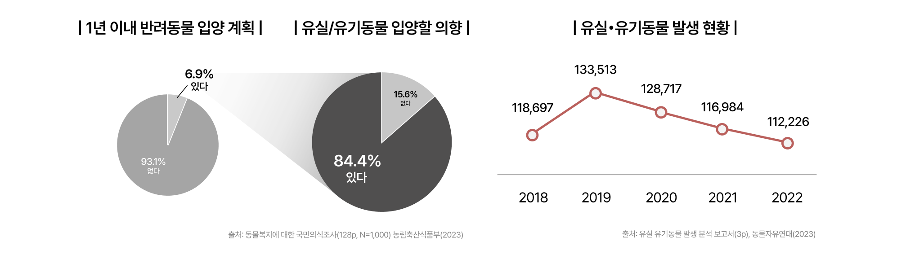

> 한국에서는 반려동물 입양 의향이 증가하고 있지만, **유기동물 발생률은 여전히 높고**, **보호소를 통한 입양률은 낮은** 상황입니다. 주요 문제로 **낮은 보호소 입양률**과 **부족한 보호 인프라**가 대두되고 있습니다.  
 

#### □ 문제 정의 
i. 신종 펫숍의 유행
 
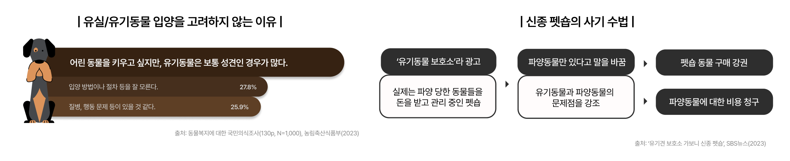

>  유기동물 보호소와 유사한 형태의 신종 펫숍이 증가하고 있습니다. 이들은 유기동물을 미끼로 삼아 불필요한 지출을 유도하며, 입양자들에게 혼란을 주고 있습니다. **신뢰할 수 있는 입양 경로**의 필요성이 대두되고 있습니다. 

 
ii. 봉사자와 보호소 간 수요·공급이 불일치 
 

> 보호소는 일손이 부족하고, 봉사자들은 참여에 어려움을 겪고 있습니다. **보호소와 봉사자를 연결**하여 양측의 필요를 효과적으로 맞추고자 합니다. 

 

#### □ 문제 해결의 필요성과 방안 
앞서 언급한 두 가지 문제는 개인 차원에서 해결하기에 **한계**가 있습니다. 

> - **정보 부족**으로 인해 개인은 입양처가 인증된 보호소인지 펫숍인지 구분하기 어렵습니다. 펫숍임을 알더라도 특정 품종이나 특징에 대한 선호로 인해 보호소의 성견 입양을 꺼릴 수 있습니다.  
> - 봉사 단체에 속하지 않은 개인은 전화나 웹사이트를 통해 봉사 신청을 해야 하는 **번거로움**이 있으며, 봉사 단체도 보호소와의 지속적인 **연락에 어려움**을 겪고 있습니다.  

이러한 이유로, 우리는 이 두 가지 문제를 **웹 서비스**로 해결하고자 합니다. **ForPaw**는 이러한 문제를 해결하기 위해 유기동물 입양을 지원하고 보호소 봉사활동을 촉진하는 플랫폼입니다.  
 

| 🔻Problem   | 1️⃣ 봉사자와 보호소 간 수요·공급이 불일치  | 2️⃣ 신종 펫숍으로 인한 혼란  |
|-------------------|----------------|--------------------|
| Why1  | 연결고리와 정보의 부재 | 입양자의 정보 부족 |
| Why2  | 일부 동아리와 단체에게만 제공된 기회 | 상호명에 대한 법적 규제 미비 |
| Why3  | 대중적이고 가시적인 봉사 신청 방법/플랫폼의 부재 | 제도적 지원과 관심이 부족 |
| **Solution**  | **봉사자와 보호소를 잇는 기능** | **신뢰 가능한 보호소와 입양자를 연결하는 기능** | 

 

### 1.2. 개발 목표 및 주요 내용 

#### □ 개발 목표 

**5 Whys 분석법**을 통해 페인포인트를 정의하고, 이를 해결하기 위한 유기동물 서비스를 기획했습니다. 그리고 아래 두 가지 대목표를 설정했습니다. 

#### □ 주요 내용 
- 컨셉 

  > - **ForPaw**는 전치사 for과 동물의 발자국을 뜻하는 paw를 합쳐 만들었으며, 우리 서비스의 목적이 온전히 동물을 위한 것이라는 포부를 담았습니다. 
  > - 메인 컬러 오렌지(#FF6636)는 활동적이고 긍정적인 이미지를 전달하며, 유기동물에 대한 관심과 사랑을 상징합니다. 
  > - 동물의 발자국과 얼굴을 오마주한 아이콘과 손 글씨로 적힌 서비스명을 함께 배치하여 서비스에 대한 친근감을 향상시킵니다. 

- 사용자 

  > - **일반 사용자**는 로그인 후 서비스가 제공하는 대부분의 기능을 이용할 수 있습니다.
  > - **보호소 관리자**는 회원가입 시 분류하여 각 지역의 보호소 직영 봉사활동을 조직하고 관리하는 역할을 부여받습니다.

- 주요 기능 

  1. 봉사활동 - 지역별 모임 
  > - 지역 기반으로 보호소와 일반 사용자가 조직한 봉사 모임에 참여할 수 있습니다.
  > - 보호소 직영 모임을 통해 정기적인 봉사활동이 가능합니다.

  2. 봉사활동 - 모임 관리 
  > - 가입 승인, 공지사항 작성, 정기 모임 조직 등 모임 관리 기능을 제공합니다.
  > - 실시간 채팅을 통해 멤버들과 소통할 수 있습니다.
    
  3. 입양 - 보호동물 
  > - 다양한 유기동물을 필터링하여 조회할 수 있습니다.
  > - 관심 동물로 지정하고 상세 정보를 확인하며, 입양 문의가 가능합니다.
    
  4. 입양 - 보호소 
  > - 위치 정보나 검색을 통해 전국의 보호소를 조회할 수 있습니다.
  > - 보호소의 상세 정보와 보호 동물 목록을 확인할 수 있습니다.
    
  5. 커뮤니티 - 궁금해요 
  > - 질문을 등록하고 답변을 주고받을 수 있는 Q&A 게시판을 제공합니다.
  > - 부적절한 게시물은 신고하여 관리됩니다.
    
  6. 채팅 
  > - 모임 멤버들과 실시간으로 채팅이 가능합니다.
  > - 사진, 파일, 링크 공유 및 공지사항 설정이 가능합니다.
 

### 1.3. 기존 서비스 대비 차별성

#### □ 기능 비교표 
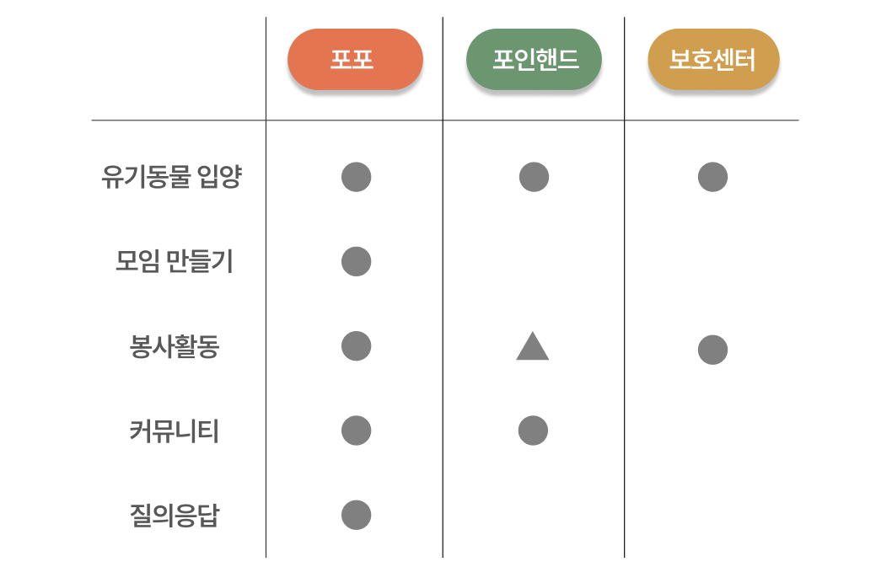

- 경쟁사 선정 
  - **종합유기견보호센터**
    > 해당 서비스는 실종 동물 찾기 전국 검색망을 제공하고 안락사 방지를 위한 유기견 무료분양을 지원합니다. 또한, 지역 유기견보호센터에 기부금과 후원을 제공하고 펫도우미, 반려동물 상식 정보를 안내합니다. 

  - **포인핸드**
    > 해당 서비스는 전국의 보호소의 유기동물과 사람을 이어주는 플랫폼입니다. 전국 보호소 유기동물 정보 실시간 조회, 실종/보호/목격 신고 기능, 유기동물 정보 SNS 공유 등의 기능을 제공합니다. 
 

- 기능 비교 
  - 입양 기능 
    > **포포**는 공공데이터를 기반으로 정보를 불러와서, 구글맵을 통해 현재 위치 정보를 활용합니다. 
    
    > **종합유기견보호센터**는 개인 간 거래로 정보가 부정확한 경우가 존재합니다. 
    
    > **포인핸드**는 누락된 동물 정보들이 존재하고 보호소 정보가 포포에 비해 부족합니다. 
  - 봉사활동 기능 
    
    > **포포**는 구글맵을 기반으로 전국의 보호소를 연결하고 모임을 생성합니다. 또, 보호소 직영으로 운영되는 봉사 모임을 운영합니다. 
    
    > **종합유기견보호센터**는 수도권 외 지역의 봉사자 모집이 미미합니다. 즉, 지역의 다양성이 존재하지 않습니다. 
    
    > **포인핸드**는 소모임 기능을 제공하지 않고 구글 폼 기반의 제한적인 봉사 참여만 허용합니다. 
  - 커뮤니티 기능 
    
    > **포포**는 사용자 간 궁금한 점을 질의응답 형식으로 쉽게 주고받을 수 있습니다. 
    
    > **포인핸드**는 메뉴가 많고 UI가 직관적이지 않아 사용성이 떨어집니다. 

  

## 2. 상세설계

### 2.1. 시스템 구성도

#### □ 아키텍쳐 
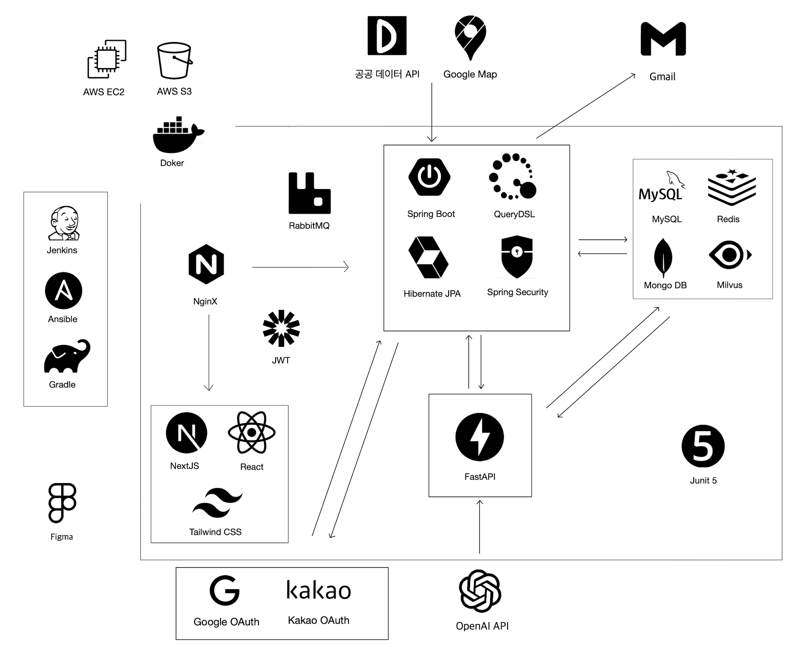
 

> - Spring Boot는 보호소 관리, 입양 지원, 봉사활동 모임 및 커뮤니티 기능을 담당하고, FastAPI는 LangChain과 연동하여 **LLM**을 활용한 분석과 Content-Based Filtering 기반의 유기동물 **추천 기능**을 제공합니다.  
> - 공공 데이터 API를 활용해 **유기동물과 보호소 데이터**를 가져오고, Google Maps API로 보호소 **위치**를 제공합니다.  
> - OpenAI API는 유기동물 **소개 글**을 자동으로 생성하는 데 활용됩니다.  
> - RabbitMQ는 비동기 메시지 큐로, **채팅** 및 **알림** 시스템에서 이벤트 기반 메시지 처리와 전달을 담당합니다.  
 

#### □ 웹 보안 체계 
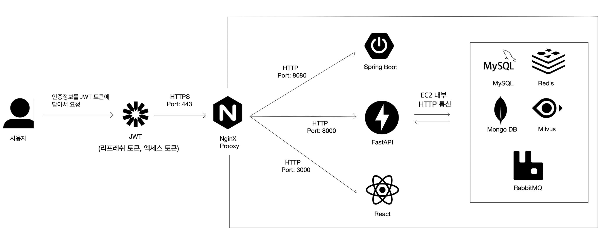
 

  > 사용자는 access token을 메모리에, refresh token을 httpOnly 쿠키에 저장하여 요청을 보냅니다. access token을 메모리에 저장함으로써 **XSS** 공격을 방지하고, refresh token을 httpOnly 쿠키에 저장하여 JavaScript 접근을 차단함으로써 **XSS**와 **CSRF** 공격에 대한 추가 보호를 제공합니다. 또 스프링 시큐리티의 CORS 정책 설정을 통해 인증되지 않은 사이트의 요청을 차단하여 보안을 강화했습니다.

 

  > 서버는 사용자 요청을 처리할 때 **JWT**의 유효성을 검증하고, 이를 프록시 서버(Nginx)를 통해 내부 애플리케이션 서버로 전달합니다. 모든 요청은 **HTTPS**로 암호화된 443번 포트로 통신이 **단일화**되어 있으며, Nginx는 외부 접근에 대한 방어막 역할을 합니다. 내부적으로는 EC2 환경 내에서 Spring Boot와 FastAPI 서버 간 HTTP 통신이 이루어져 외부 공격으로부터 안전하게 보호됩니다.

 

#### □ 유기 동물 데이터 패치 과정 
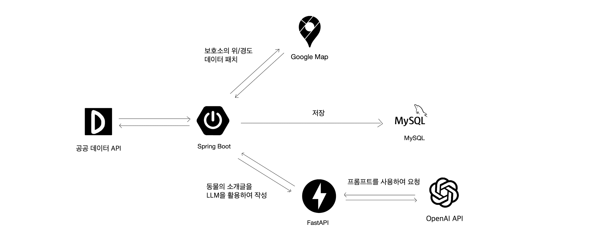
  

  > 스프링 부트의 cron job을 통해 주기적으로 공공 데이터 API에서 유기 동물 및 보호소 데이터를 가져와 최신 정보로 업데이트합니다. 보호소 주소(자연어)는 Google Maps API를 통해 위치 정보(위도, 경도)로 변환하여 저장합니다. FastAPI와 OpenAI API는 유기 동물의 자동 소개 글을 생성하는 데 사용되며, 최종적으로 모든 데이터는 MySQL에 저장됩니다.

 

  >  Google Maps API로 얻은 위치 정보는 사용자의 현재 위치를 기준으로 근처 보호소를 지도에 표시하는 데 활용됩니다.

 

#### □ ERD 
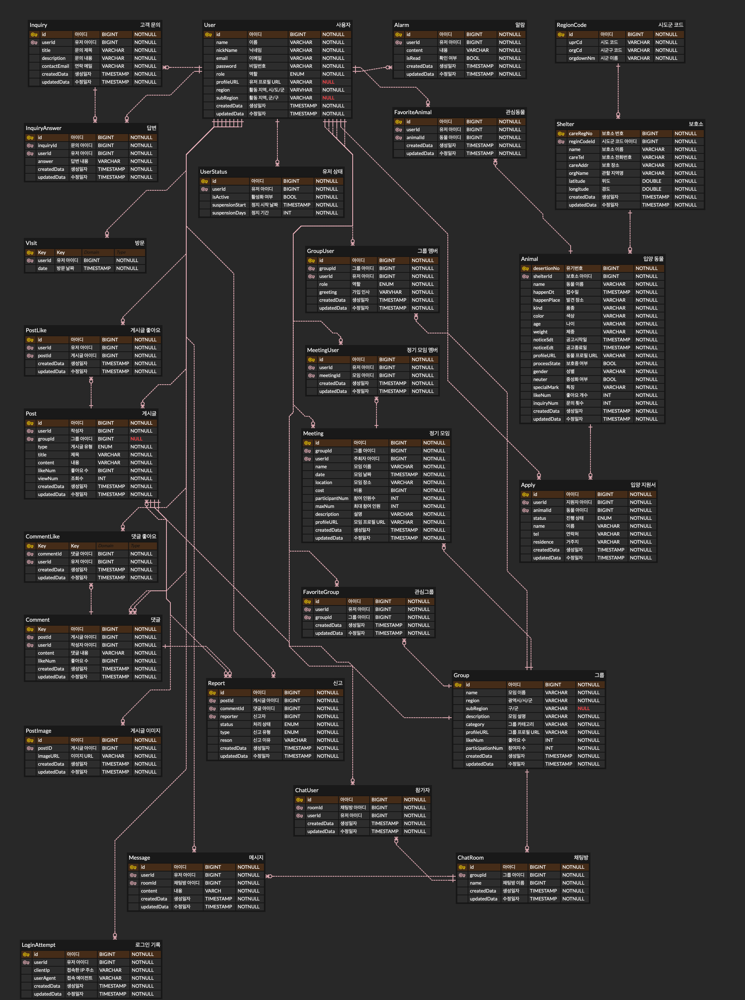
  

### 2.2. 사용 기술
| 번호  | 구분  | 버젼  |
|:----:|:-----:|:-----:|
| 1  | MySQL | 8.0.33 |
| 2  | Java JDK | 17.0.9 |
| 3  | JWT | 4.3.0 |
| 4  | QueryDSL | 5.0.0 |
| 5  | MongoDB | 2.2.0 |
| 6  | RabbitMQ | 3.13.0 |
| 7  | FastAPI | 0.110.3 |
| 8  | Spring Boot | 3.2.0 |
| 9  | Milvus | 2.4.1 |
| 10 | NextJS | 12 |
| 11 | Junit5 | 5.10.2 |
| 12 | Nginx | 1.26 |
| 13 | Tailwind CSS | 3.4.3 |
| 14 | Jenkins | 2.452.2 |
| 15 | Gradle | 8.5 |
| 17 | Figma | UI3 |
 

## 3. 개발결과
### 3.1. 전체시스템 흐름도 

#### □ IA (information architecture) 
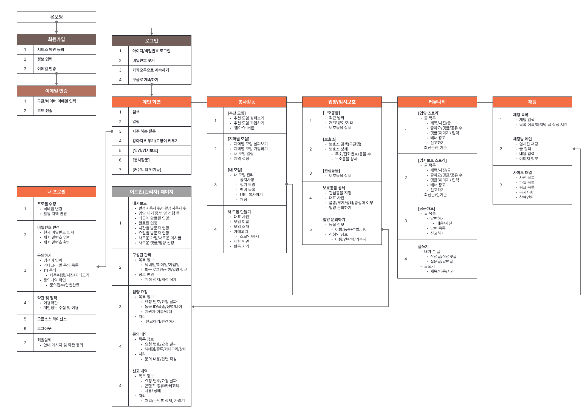
 

### 3.2. 기능설명 

| 분류                | 기능1                                      | 기능2                        |
|-----------------------|----------------------------------------|--------------------------------------------------------------|
| 봉사활동     |  | |
| 입양        |  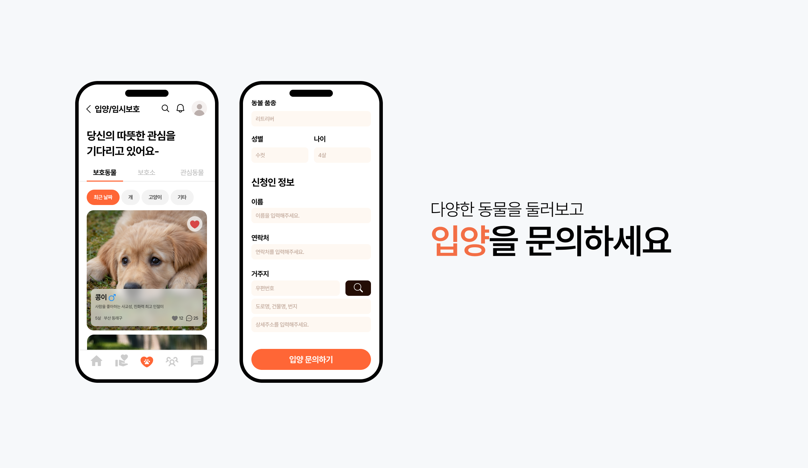| 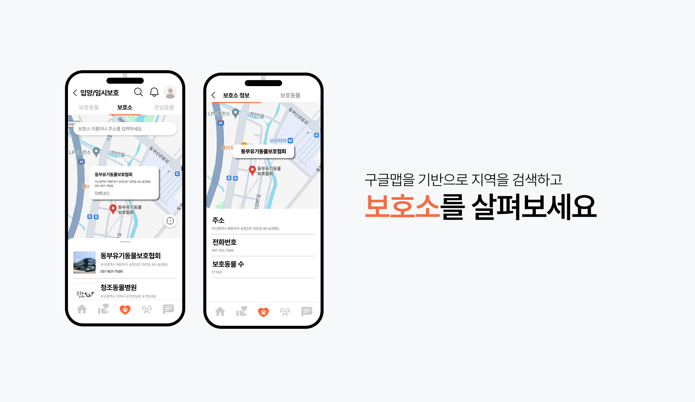 |
| 커뮤니티      |  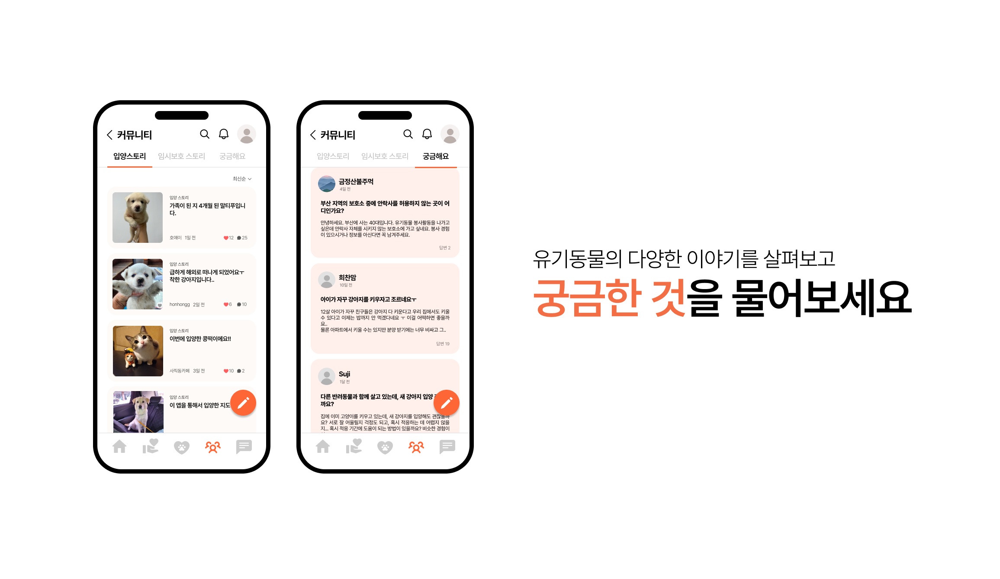|     |
 

### 3.3. 기능명세서
> 포포에는 현재 **114**개의 API가 개발되어 있으며, 자세한 내용은 분량상 네이버 블로그에 정리해 두었습니다.  
> **API Part 1** => https://blog.naver.com/hoyai-/223564816915  
> **API Part 2** => https://blog.naver.com/hoyai-/223519299515  
 

## 4. 소개 및 시연 영상

> 🎥 **전체 시연 영상**  
> https://www.youtube.com/watch?v=0g1GArg-B5Y
 

1️⃣ **회원가입**

https://github.com/user-attachments/assets/e4e08d1d-abe4-4e7c-b25e-61040af71875

 

2️⃣ **메인 화면**

https://github.com/user-attachments/assets/2de3bee5-4646-46da-8a1b-2914adc17044

 

3️⃣ **봉사활동**

https://github.com/user-attachments/assets/71eb1ef2-a43b-4405-a437-dedd9632c99f

 

4️⃣ **입양**

https://github.com/user-attachments/assets/587b5538-1cb3-4f62-995e-2e58afab7ae2

 

5️⃣ **커뮤니티**

https://github.com/user-attachments/assets/ac284a0d-b082-472f-b7f9-5e547aba2674

 

6️⃣ **채팅**

https://github.com/user-attachments/assets/239a0d1a-fd2b-4c8a-ae5a-95ac1300bdb2

 

## 5. 팀 소개

| 이름   | 역할 | 내용 |
|:----:|:----:|------|
| 이한홍  | BE (리드) | <ul><li>REST API 및 DB 설계</li><li>Figma를 활용한 관리자 페이지 UI/UX 디자인</li><li>공공 데이터 API를 활용한 유기 동물 데이터 수집 및 처리 구현</li><li>JWT와 OAuth 2.0을 활용한 Google, Kakao 소셜 로그인 및 인증 기능 구현</li><li>FastAPI와 OpenAI API를 활용한 유기 동물 소개글 자동 생성 로직 구현</li><li>RabbitMQ를 활용한 실시간 단체 채팅 기능 구현</li><li>AWS EC2 배포 및 Jenkins를 활용한 CI/CD 파이프라인 구축</li><li>API 개발 (API #1 ~ #102)</li></ul> |
| 이종일  | FE | <ul><li>전체적인 레이아웃 구현</li><li>SSR을 활용하여 사용자 요청에 따른 효율적인 동적 데이터 처리 구현</li><li>SSR과 JWT 토큰 기반 인증으로 효율적인 로그인 상태 관리 및 접근 제어 로직 개발</li><li>WebSocket을 활용한 실시간 메시지 송수신 단체 채팅방 구현</li><li>S3를 활용하여 채팅방에서 사진 및 파일 업로드 기능 추가</li><li>구글 맵 API를 활용하여 보호소 위치 시각화</li><li>입력 폼에서 실시간 피드백을 제공하는 마이크로 메시지 로직 설계 및 구현</li></ul> |
| 장재영  | FE | <ul><li>봉사활동, 검색, 관리자 페이지 구현</li></ul> |
| 박정우  | BE | <ul><li>Spring Boot를 활용한 관리자 페이지 API 개발 (API #103 ~ #114)</li></ul> |
