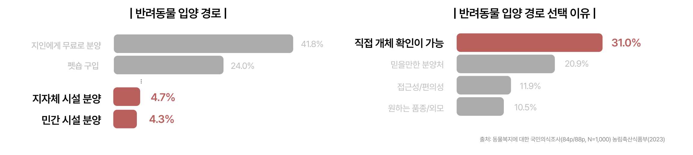
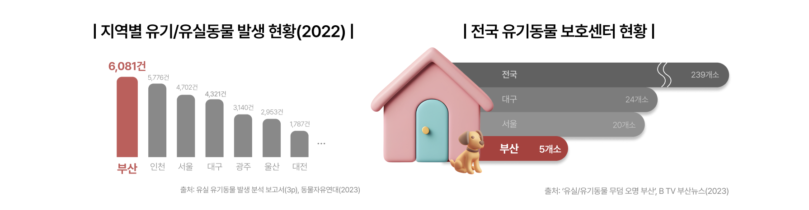
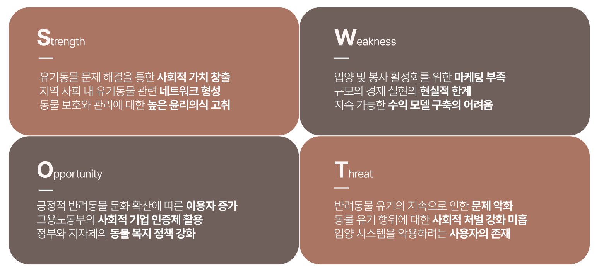
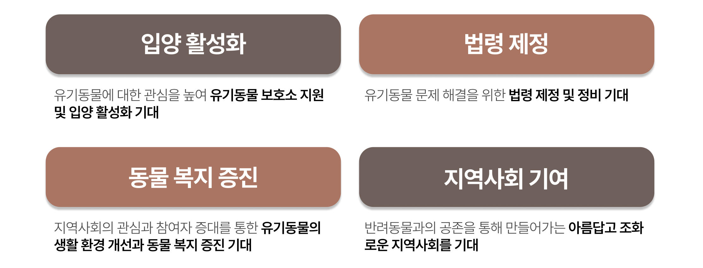

  

> 미리보기
> - 💡 [프로젝트 소개](#1-프로젝트-소개) 
> - 📌 [주요 내용](#-주요-내용) 
> - ☀️ [타 서비스와 차별점](#14-기존-서비스-대비-차별성) 
> - 📱 [서비스 사용 방법](#4-설치-및-사용-방법) 
> - 🙇🏻‍♂️ [팀 소개](#6-팀-소개) 
 

## 1. 프로젝트 소개
### 1.1. 개발배경 및 필요성
#### □ 개발 배경 

> 지금은 반려동물의 시대입니다. 한국의 반려가구 수는 2020년 532만 가구에서 2022년 552만 가구로 2.8%p 상승했습니다[^1]. 동물 문제 대한 전국민적 인식 향상에 따라 유기·유실동물은 지속해서 감소하고 있고((’20) 130만 마리 → (’21) 118만 마리 → (’22) 113만 마리)[^2], 향후 1년 이내 반려동물 입양 계획이 있는 응답자 중 유실·유기 동물을 입양할 의향이 있는 비율은 84.4% 였습니다[^3]. 이렇듯 유실·유기동물에 관한 인식 수준이 개선되고 있고, 입양도 증가하고 있는 상황입니다. 
 
i. 저조한 보호소 입양율과 펫숍 선호 현상 
 

> 하지만 이러한 현상과는 달리, 동물을 입양하는 과정에서 지인에게 무료로 분양을 받거나(41.8%) 펫숍에서 구입하는 비율(24.0%)에 비해 지자체 동물 보호센터(4.7%)나 민간 동물보호 시설(4.3%)에서 입양하는 비율은 현저히 낮았습니다[^4]. 이는 직접 개체 확인이 가능하고 원하는 품종·생김새의 동물을 선택할 수 있는 곳에서 입양하고 싶은 의견이 반영되었기 때문입니다[^5]. 그렇기 때문에 펫숍의 입양 비용(평균 57.9만 원)이 민간 보호시설(평균 17.7만 원)과 지인에게 분양(평균 35.1만 원) 받는 것보다 훨씬 비쌈에도 불구하고 여전히 인기가 있는 것입니다[^6]. 한 연구는 이러한 현상을 '가장 쉽고 편하게 원하는 품종을 구하고자 하는 경향이 반영된 것'이라고 분석했습니다.[^7] 
 
ii. 지역 유기동물 관리의 현실 

 

> 그리고 유실·유기동물과 관련된 부산의 상황은 그렇게 낙관적이지 않습니다. 부산은 모든 광역시 중 한 해에 발생하는 유기·유실 동물 수가 가장 많지만[^8], 부산의 동물보호센터는 단 5개소에 불과합니다[^9]. 서울에 16개소, 대구에 23개소가 있는 것과 비교하면 턱없이 작은 숫자입니다. 그마저도 지자체 직영으로 운영되는 곳이 없기 때문에 상황은 더욱 열악합니다. 동물보호센터의 부족도 문제지만 센터 내에서의 동물 관리 실태는 더욱 심각합니다. 부산 유기동물의 자연사율은 전국 1위(57%)이고, 안락사율은 전국 최하위(2.7%)를 기록했으며, 이는 '원인 분석 및 대책 마련이 필요한 것'이라고 언급했습니다[^10]. 또한, 유실·유기동물이 질병이나 사고로 사망하는 수가 매년 3천 마리 이상이고, 3년간 예방접종 비율이 1.8%에 그치는 등 관리가 제대로 되지 않는 상황입니다[^11].  
 

#### □ 개발 필요성 
i. 신종 펫숍의 유행
 

> 동물 분양을 원하는 사람들은 유실·유기동물 입양을 고려하지 않는 이유로 ‘어린 동물을 키우고 싶지만, 유기동물은 보통 성견이 많다(38.9%)’, ‘입양 방법이나 절차 등을 잘 모른다(27.8%).'를 꼽았습니다[^12]. 동물의 특징과 특성에 따라 분양자의 선호가 나뉘고, 좋은 마음으로 유기동물을 입양하려고 해도 여전히 특정 종이나 크기에 따른 선호의 차이가 존재한다는 의미입니다. 이런 흐름에 따라 현재 ‘유기동물 보호소’ 라는 이름을 가진 신종 펫숍이 유행하고 있습니다. 

> 이는 지자체 유기견 보호소나 동물 단체에서 운영하는 센터가 아닌, 이름만 보호소로 바꾼 펫숍인 것입니다. 이곳에서는 유기동물을 미끼로 삼아 사람들을 모은 후 유기동물에 대한 단점을 설명하거나 혹은 아예 유기동물을 보여주지도 않은 채, 유기동물이 아닌 파양동물을 높은 금액을 지불하고 분양받도록 강권합니다[^13]. 하지만, 신종 펫숍은 귀엽고 키우기 쉬운 작은 품종을 분양할 수 있다고 광고하고 있기 때문에 계속 수요가 존재하고, 보호소 명칭을 쓰지 못하게 하는 동물보호법 개정안이 아직 국회에서 통과하지 못했기에 이런 형태의 사업이 여전히 확장하고 있습니다[^14]. 
 
ii. 봉사자와 보호소 간 수요·공급이 불일치 
 

> 또한, 열악한 인프라를 가진 부산의 동물보호센터에는 일손이 많이 필요한 상황입니다. 유기동물 봉사에 대한 수요가 꾸준히 있음에도 관련 서비스의 부족과 인프라 구축의 부재로 시민의 참여가 더딘 것이 현실입니다. 하나의 예로, 부산동물보호센터의 네이버 카페에는 매주 주말마다 5개에서 50개의 봉사 신청 댓글이 달리고 있습니다[^15]. 부산대 유기견 봉사 동아리 前 회장은 센터에서 원하는 봉사 인력이 그때그때 다르기 때문에 수요에 맞는 공급을 제공할 수 있는 서비스가 있으면 좋을 것 같다고 말했습니다. 다른 동아리원은 많은 보호소가 봉사자의 유동적인 참여를 원하기 때문에 선한 마음으로 봉사에 참여하려고 하는 봉사자 입장에서는 제약 조건이 존재한다고 이야기했습니다.[^16] 

> 이러한 수요와는 반대로 보호소의 경우에는 인력이 부족한 경우가 많습니다. 홍보가 제대로 이루어지지 않는 보호소의 경우 봉사 인력을 구하기가 쉽지 않은 상황입니다. 한 기자는 부산의 유기동물보호소에서 봉사 후 '돈을 받고 하는 일이 아니기 때문에 항상 인력 부족에 시달리고 있다.'고 언급했습니다[^17]. 수도권을 제외한 지역의 경우 관리 인력이 적고 인프라가 부족하여 보호센터 관리 자체가 힘든 경우도 있습니다. 
 

#### □ 동기 및 해결방안 
앞의 내용을 정리하면 다음과 같습니다.  
 
> 1. 유기동물의 입양 선호가 높은 것에 비해 실제로 지자체 동물 보호센터나 민간 동물보호시설에서 입양하는 비율은 낮았으며, 이는 동물의 특징과 특성이 분양자의 선호에 반영된다는 것을 보여줍니다. 이러한 선호는 신종 펫숍의 유행으로 이어졌으며, 사람들은 유기동물로 둔갑한 동물을 값을 내고 구매하고 있습니다. 

> 2. 부산의 부족한 동물보호센터 인프라와 인력은 동물 관리의 어려움으로 이어지고 있고 도움의 손길을 바라지만, 봉사를 원하는 사람들은 여전히 양질의 봉사 정보를 얻지 못하고 있습니다.
 
앞서 정의한 두 가지 문제는 개인 차원에서 감당하기에 한계가 있습니다. 
  

> 정보의 부족으로 인해 개인은 입양 하는 곳이 인증을 받은 보호소인지 펫숍인지 구분하기 힘들고, 또한 펫숍이라는 사실을 안다고 해도 특정 종이나 특징에 대한 선호가 남아있는 이상 보호소에 있는 성견과 같은 동물의 입양을 꺼릴 가능성이 있습니다. 그리고 봉사 집단에 가입하지 못한 개인은 전화나 웹사이트를 통해 봉사 신청을 하는 과정이 까다롭고, 봉사 집단도 보호소와의 지속적인 컨택에 어려움을 겪는 상황이 지속되고 있습니다.  
 
이러한 이유로 인해, 우리는 앞서 정의한 두 가지 문제를 앱 서비스로 해결하고자 합니다. 아직 법이 감싸지 못한 범위를 서비스에 담아 사각지대를 지키고, 개인이 해결하기 힘든 문제들을 하나의 서비스에 담아 편리함을 제공하는 계획을 수립했습니다. 
 

### 1.2. 개발 목표 및 주요 내용 

#### □ 개발 기간 

> PNU 창의융합 SW해커톤 진행 기간(5월~9월) 

> 대회 이후 개발을 지속하고 BM 모델을 구체화하여 창업 지원에 도전할 계획입니다.
 

#### □ 개발 목표 

우리는 적절한 봉사자를 원하는 보호소의 수요와 편리하게 봉사에 신청할 수 있는 서비스를 원하는 공급이 일치하지 않는다는 점과, 신종 펫숍이으로 인한 혼란을 문제로 설정했습니다. 그리고 5 Whys 분석법[^18]을 통해 페인포인트를 정의하고, 이를 해결하기 위한 유기동물 서비스를 기획, 개발했습니다. 그리고 아래 두 가지 대목표를 상정했습니다. 

 

#### □ 5 whys 분석법 

| 🔻Problem   | 1️⃣ 봉사자와 보호소 간 수요·공급이 불일치  | 2️⃣ 신종 펫숍으로 인한 혼란  |
|-------------------|----------------|--------------------|
| Why1  | 연결고리와 정보의 부재 | 입양자의 정보 부족 |
| Why2  | 일부 동아리와 단체에게만 제공된 기회 | 상호명에 대한 법제도 x |
| Why3  | 대중적이고 가시적인 봉사 신청 방법/플랫폼의 부재 | 제도적 지원과 관심이 부족 |
| Solution  | **봉사자와 보호소를 잇는 기능** | **신뢰 가능한 보호소와 입양자를 연결하는 기능** |
 

#### □ 주요 내용 
- 컨셉 
  > 서비스명인 포포(ForPaw)는 전치사 for과 동물의 발자국을 뜻하는 paw를 합쳐 만들었으며, 우리 서비스의 목적이 온전히 동물을 위한 것이라는 포부를 담았습니다. 
  
  > 메인 컬러인 오렌지(#FF6636)는 활동적이고 긍정적인 이미지를 전달하며, 유기동물에 대한 관심과 사랑을 상징합니다. 
  
  > 동물의 발자국과 얼굴을 오마주한 아이콘과 손 글씨로 적힌 서비스명을 함께 배치하여 서비스에 대한 친근감을 향상시킵니다. 
 

- 사용자 
  > 서비스의 사용자는 일반 사용자, 보호소 관리자로 구분됩니다. 일반 사용자는 로그인 후 서비스가 제공하는 대부분의 기능을 이용할 수 있습니다. 보호소 관리자는 회원가입 시 분류하여 각 지역의 보호소 직영 봉사활동을 조직하고 관리하는 역할을 부여받습니다. 
 

- 주요 기능 

  1. 봉사활동 - 지역별 모임 
    > 사용자는 지역을 기반으로 보호소가 조직한 모임과 일반 사용자가 조직한 모임에서 활동할 수 있습니다. 특히 보호소가 직영으로 운영하는 모임에서 정기적인 봉사활동을 진행할 수 있다는 것이 장점입니다.

  2. 봉사활동 - 모임 관리 
    > 사용자는 가입승인을 받은 후 모임에 들어와서 정기모임에 참여하고 채팅을 나눌 수 있습니다. 모임 관리자는 가입승인 대기 중인 사용자를 승인하고 공지사항을 작성하며, 정기 모임을 조직하고 멤버를 탈퇴시킬 수 있습니다. 보호소 관리자는 보호소 직영으로 운영하는 모임을 생성하여 편리하게 봉사를 진행할 수 있습니다.
    
  3. 입양 - 보호동물 
    > 사용자는 다양한 유기동물을 한눈에 볼 수 있습니다. 최근에 올라온 동물, 개, 고양이, 기타의 필터를 사용할 수 있으며, 사진에 있는 하트 버튼을 통해 관심동물로 지정할 수 있습니다. 또한, 다양한 상세 정보를 확인하고 각종 개인정보를 기재한 후 입양을 문의할 수 있습니다.
    
  4. 입양 - 보호소 
    > 사용자는 자신의 위치정보나 검색을 통해 지역과 키워드를 설정하여 공공데이터에 등록된 전국의 보호소를 검색할 수 있습니다. 보호소 정보에서 주소와 전화번호, 동물 수를 확인하고 보호동물의 몸무게와 중성화 수술 여부 등 상세 정보를 확인할 수 있습니다.
    
  5. 커뮤니티 - 궁금해요 
    > 사용자는 제목과 본문을 적고 사진을 첨부하여 궁금한 점을 자유롭게 질문할 수 있습니다. 다른 사용자의 질문을 확인하고 답변을 남길 수 있으며, 부적절한 글이나 댓글이 있을 경우 신고할 수 있습니다
    
  6. 채팅 
    > 사용자는 가입한 봉사활동 모임의 멤버들과 채팅을 나눌 수 있습니다. 실시간으로 사진, 파일, 링크를 업로드할 수 있고, 공지사항을 설정할 수 있습니다. 
 

### 1.3. 기존 서비스 대비 차별성

#### □ 기능 비교표 

- 경쟁사 선정 
  - **종합유기견보호센터**
    > 해당 서비스는 실종 동물 찾기 전국 검색망을 제공하고 안락사 방지를 위한 유기견 무료분양을 지원합니다. 또한, 지역 유기견보호센터에 기부금과 후원을 제공하고 펫도우미, 반려동물 상식 정보를 안내합니다. 

  - **포인핸드**
    > 해당 서비스는 전국의 보호소의 유기동물과 사람을 이어주는 플랫폼입니다. 전국 보호소 유기동물 정보 실시간 조회, 실종/보호/목격 신고 기능, 유기동물 정보 SNS 공유 등의 기능을 제공합니다. 
 

- 기능 비교 
  - 입양 기능 
    > **포포**는 공공데이터를 기반으로 정보를 불러와서, 구글맵을 통해 현재 위치 정보를 활용합니다. 
    
    > **종합유기견보호센터**는 개인 간 거래로 정보가 부정확한 경우가 존재합니다. 
    
    > **포인핸드**는 누락된 동물 정보들이 존재하고 보호소 정보가 포포에 비해 부족합니다. 
  - 봉사활동 기능 
    
    > **포포**는 구글맵을 기반으로 전국의 보호소를 연결하고 모임을 생성합니다. 또, 보호소 직영으로 운영되는 봉사 모임을 운영합니다. 
    
    > **종합유기견보호센터**는 수도권 외 지역의 봉사자 모집이 미미합니다. 즉, 지역의 다양성이 존재하지 않습니다. 
    
    > **포인핸드**는 소모임 기능을 제공하지 않고 구글 폼 기반의 제한적인 봉사 참여만 허용합니다. 
  - 커뮤니티 기능 
    
    > **포포**는 사용자 간 궁금한 점을 질의응답 형식으로 쉽게 주고받을 수 있습니다. 
    
    > **포인핸드**는 메뉴가 많고 UI가 직관적이지 않아 사용성이 떨어집니다. 

  

### 1.4. 사회적가치 도입 계획
#### □ 사업화 계획 

- 유저 확보
  
  > 해당 서비스가 지속 가능한 사회적 기업으로 자리 잡기 위해서는 유기동물 문제를 해결하면서 동시에 다양한 수익 모델을 가지고 있어야 합니다. 포포가 유기동물 관련 인식을 제고하고 지역의 각종 문제를 해결 하기 위해 우선으로 지역에서 해결할 수 있는 문제에 집중하여 개발을 진행합니다.  

  > 이후 부산 지역 내 동물 보호소와의 연결을 통해 서비스를 소개하고 등록을 돕습니다. 또한, 부산대학교 유기견 동아리를 비롯한 다양한 동물 단체와 컨택하여 실제로 서비스가 활용되도록 독려합니다. 그리고 봉사 활동 매칭과 올바른 유기동물의 입양, 봉사 커뮤니티 및 그룹 기능을 지원하는 포포의 존재와 함께, 유기동물에 대한 인식 개선 캠페인을 진행하며 서비스를 홍보합니다. 이를 통해 유저를 모으고 트래픽을 상승시킬 수 있습니다.
 

- 정책 지원(창업 지원)
  
  > 그 후 점차 지역 사회 또는 다양한 기업의 동물 복지 정책 및 지원 사업과 연계하여 시너지 효과를 창출하여 사용층을 확대합니다. 이러한 사회적 기반과 서비스 안전성을 바탕으로 국가 및 지자체의 창업지원사업을 적극 활용하여 초기 운영의 안정성을 확보합니다. 아래는 우리 서비스가 지원해 볼 수 있는 각종 지원 사업·제도 목록입니다. 조건과 대상에 맞게 서비스를 디벨롭한 후 지원할 계획입니다.  

  > ``지역 기반 스타트업 지원 사업``: 부산시 창업지원단
   
  > ``예비창업패키지``: 중소벤처기업부 창업진흥원
  
  > ``예비 창업 지원``: 부산대학교 창업지원단
  
  > ``동물복지 지원 사업``: 경기도경제과학진흥원
  
  > ``예비 사회적기업 인증``: 한국사회적기업진흥원, 광역자치단체·관할부처
  
  > ``사회적 기업 지원 제도``: 한국사회적기업진흥원
  
  > ``예비 사회적 기업 전문 컨설팅 지원 사업``: 한국사회적기업진흥원
 

- BM 모델
  
  > 그리고 BM 모델로는 B2B를 채택하여 3가지 수익 모델을 고안했습니다.
  
  > **첫 번째**는 보호소가 사용할 수 있는 툴을 제공하고 수수료를 받는 것입니다. 보호소 관리자들이 유기동물 보호소를 보다 효율적으로 운영할 수 있도록 하는 관리 툴을 제공하고, 이를 사용하기 위해 보호소가 수수료를 지불하도록 합니다. 이 툴은 봉사모임 조직, 모임 관리, 입양 프로세스 관리, 보호소 정보 업데이트 등의 기능을 포함합니다.
  > - 시장 크기: 전국적으로 등록된 200개 이상의 유기동물 보호소
  > - 가격 책정: 월 구독료 1만원~3만원
  > - 도입 목표: 1년 내 20% 보호소 도입

  > **두 번째**는 플랫폼에서 수집한 사용자 데이터를 기반으로 보호소나 관련 기업이 필요로 하는 맞춤형 배너 광고를 제공하는 것입니다. 예를 들어, 유기동물 입양을 희망하는 사용자에게 사료나 애완용품 광고를 제공하거나, 봉사활동에 관심 있는 사용자에게 해당 활동 관련 광고를 보여줍니다.
  > - 시장 크기: 평균 1,000명의 일일 활성 사용자(DAU)와 10,000명의 월간 활성 사용자(MAU)
  > - 가격 책정: CPM(1,000회 노출당 비용): 1,000원 ~ 3,000원 / CPC(클릭당 비용): 100원 ~ 300원
  
  > **세 번째**는 다양한 기업과 협력하여 CSR(사회적 책임) 활동의 일환으로 유기동물 보호소 지원 프로그램을 설계하고 운영하는 서비스를 제공하는 것입니다. 이 서비스는 기업이 보호소 후원, 직원 자원봉사 프로그램, 기부 캠페인 등을 보다 쉽게 관리하고 실행할 수 있도록 돕습니다.
  > - 시장 크기: 중견 및 대기업 30곳과의 협업 목표
  > - 가격 책정: 프로그램 설계 비용: 200만 원 ~ 500만 원 (기업당, 1회성) / 운영 관리 수수료: 월 50만 원 ~ 100만 원 (기업당)
  > - 도입 목표: 1년 내 10개의 기업과 협업

 

####  □ SWOT 분석[^19]  

- 결론 
  > 다양한 채널을 활용하여 서비스 인지도를 제고하고, 표준화된 프로세스의 시스템 개발로 효율성을 높여야 합니다.  
  
  > 동물 복지 정책 및 지원 사업과 연계하여 시너지 효과를 창출하고, 정부 및 지자체의 정책 변화에 능동적으로 대응해야 합니다.  
 

####  □ 기대 효과 
포포가 지속 가능한 사회적 서비스로서 반려동물 문화의 발전을 선도하기를 기대합니다. 

 

## 2. 상세설계

### 2.1. 시스템 구성도

#### □ Architecture 

  

#### □ Web Security 

  

  > 사용자는 access token을 메모리에, refresh token을 httpOnly 쿠키에 저장해 요청을 보냅니다. access token을 메모리에 저장하면 **XSS** 공격으로부터 보호할 수 있으며, refresh token을 httpOnly 쿠키에 저장하면 JavaScript로 접근할 수 없어 **XSS**와 **CSRF** 공격에 대해 추가적인 보호가 가능합니다. 또 스프링 시큐리티에서 설정한 CORS 정책을 통해 인증되지 않은 사이트가 요청을 보내거나 응답을 읽는 것을 차단하여 보안을 강화하였습니다.

 

  > 서버 측에서는 사용자로부터 받은 요청을 처리할 때, **JWT**의 유효성을 검증한 후 이를 프록시 서버(Nginx)를 통해 내부 애플리케이션 서버로 전달합니다. 모든 요청은 **HTTPS**로 암호화되어 443번 포트로 통신이 **단일화**되며, Nginx를 거쳐야 하기 때문에 외부로부터 서버를 보호하는 방어막 역할을 합니다. 내부적으로는 Spring Boot와 FastAPI 같은 백엔드 서버가 HTTP로 통신하지만, 이는 EC2 내부에서만 이루어지기 때문에 외부 공격으로부터 안전하게 구성되어 있습니다.

 

#### □ 유기 동물 데이터 패치 과정 

  

  > 스프링 부트의 cron job을 통해 주기적으로 공공 데이터 API에 요청을 보내 보호소의 유기 동물 데이터를 가져오고, 이를 바탕으로 보호소와 동물 정보를 업데이트합니다. 이후, 보호소 주소(자연어)를 이용해 Google Maps API로 위치 정보(위도, 경도)를 가져옵니다. 또한, FastAPI와 OpenAI API를 활용해 유기 동물의 소개 글을 자동으로 생성합니다. 최종적으로 모든 동물 정보는 MySQL에 저장됩니다.

 

  >  Google Maps API로 가져온 위도와 경도 정보는 사용자의 현재 위치를 기준으로 근처 보호소를 지도에 표시하는 데 활용됩니다.

 

#### □ ERD 

  

### 2.2. 사용 기술
| 번호  | 구분  | 버젼  |
|:----:|:-----:|:-----:|
| 1  | MySQL | 8.0.33 |
| 2  | Java JDK | 17.0.9 |
| 3  | JWT | 4.3.0 |
| 4  | QueryDSL | 5.0.0 |
| 5  | MongoDB | 2.2.0 |
| 6  | RabbitMQ | 3.13.0 |
| 7  | FastAPI | 0.110.3 |
| 8  | Spring Boot | 3.2.0 |
| 9  | Milvus | 2.4.1 |
| 10 | NextJS | 12 |
| 11 | Junit5 | 5.10.2 |
| 12 | Nginx | 1.26 |
| 13 | Tailwind CSS | 3.4.3 |
| 14 | Jenkins | 2.452.2 |
| 15 | Gradle | 8.5 |
| 17 | Figma | UI3 |
 

## 3. 개발결과
### 3.1. 전체시스템 흐름도 

#### □ IA (information architecture) 

 

### 3.2. 기능설명 

| 분류                | 기능1                                      | 기능2                        |
|-----------------------|----------------------------------------|--------------------------------------------------------------|
| 봉사활동     |  | |
| 입양        |  |  |
| 커뮤니티      |  |     |
 

### 3.3. 기능명세서
> 포포에는 현재 **114**개의 API가 개발되어 있으며, 자세한 내용은 분량상 네이버 블로그에 정리해 두었습니다.  
> **API Part 1** => https://blog.naver.com/hoyai-/223564816915  
> **API Part 2** => https://blog.naver.com/hoyai-/223519299515  
 

### 3.5. 사업체 멘토링 의견반영사항 
- ``기획 파트`` 
  - '지역 상황 비교 시 추가 정보 제공'에 대한 피드백 
    > 기존 보고서에 부산과 타지역의 보호소 수나 현황을 비교하는 자료가 부족했습니다. 해당 피드백을 바탕으로 지역별 유실·유기동물 수 비교 자료[^8], 지역별 동물보호센터 비교 자료[^9], 지역별 자연사율·안락사율 비교 자료[^10]를 추가했습니다. 이를 바탕으로 부산 지역 보호소의 문제점을 여실히 드러내고 관련 서비스의 필요성을 제고했습니다. 또한, 도표를 함께 첨부하여 설득력을 높였습니다. 
  - '5 whys 분석법'에 대한 피드백 
      > 5 whys 분석법에 대한 구체적인 정의를 포함하지 않은 채 보고서를 작성했습니다. 피드백을 바탕으로 각주[^18]에 의미와 설명을 추가했습니다. 이를 통해 분석법의 개념을 모르는 사람도 쉽게 이해할 수 있게 했습니다. 
  - '사업화 계획'에 대한 피드백 
      > 사업화 계획 안에 포함된 정책 지원과 BM 모델이 구체적으로 작성되어 있지 않았습니다. 추가 리서치를 통해 사업화 계획을 유저 확보, 정책 지원, 그리고 BM 모델로 분류하여 정리했습니다. 먼저 지역을 중심으로 유저를 확보하고 트래픽을 늘린 후, 각종 지원사업에 전략적으로 지원하여 혜택을 얻고, 구체적인 BM 모델을 수립하여 지속 가능한 서비스가 되도록 합니다. 
 

## 4. 소개 및 시연 영상

> 아래 영상을 재생하고 포포의 다양한 기능을 살펴보세요!  
> https://www.youtube.com/watch?v=0g1GArg-B5Y
 

1️⃣ 회원가입

https://github.com/user-attachments/assets/e4e08d1d-abe4-4e7c-b25e-61040af71875

 

2️⃣ 메인 화면

https://github.com/user-attachments/assets/2de3bee5-4646-46da-8a1b-2914adc17044

 

3️⃣ 봉사활동

https://github.com/user-attachments/assets/71eb1ef2-a43b-4405-a437-dedd9632c99f

 

4️⃣ 입양

https://github.com/user-attachments/assets/587b5538-1cb3-4f62-995e-2e58afab7ae2

 

5️⃣ 커뮤니티

https://github.com/user-attachments/assets/ac284a0d-b082-472f-b7f9-5e547aba2674

 

6️⃣ 채팅

https://github.com/user-attachments/assets/239a0d1a-fd2b-4c8a-ae5a-95ac1300bdb2

 

## 5. 참고문헌 및 출처

[^1]: 출처: 한국 반려동물 보고서(18p), KB경영연구소(2023)
[^2]: 출처: 반려동물 보호복지 실태조사(3p), 농림축산식품부(2023)
[^3]: 출처: 동물복지에 대한 국민의식조사(128p, N=1,000), 농림축산식품부(2023)
[^4]: 출처: 동물복지에 대한 국민의식조사(84p, N=1,000), 농림축산식품부(2023)
[^5]: 출처: 동물복지에 대한 국민의식조사(88p, N=1,000), 농림축산식품부(2023)
[^6]: 출처: 동물복지에 대한 국민의식조사(179p, N=1,000), 농림축산식품부(2023)
[^7]: 출처: 반려동물 입양과정과 유기동물 발생에 대한 관련성 고찰 및 해결방안 모색, 한세명 외 4명(2022)
[^8]: 출처: 유실·유기동물 발생 분석 보고서(3p), 동물자유연대(2023)
[^9]: 출처: 동물 보호·복지 실태조사, 농림축산검역본부(2024)
[^10]: 출처: 유실·유기동물 발생 분석 보고서(51p), 동물자유연대(2023)
[^11]: 출처: ‘유실·유기동물 무덤 오명 부산', B tv 부산뉴스(2023)
[^12]: 출처: 동물복지에 대한 국민의식조사(130p, N=1,000), 농림축산식품부(2023)
[^13]: 출처: '유기견 보호소 가보니 신종 펫숍', SBS뉴스(2023)
[^14]: 출처: '유기견 보호소에 유기견이 없다...', 비디오머그(2023) 
[^15]: 출처: '부산유기동물보호센터 가유품사 네이버 카페-성인 주말봉사 신청'(2024.08.16.)
[^16]: 출처: In-Depth 인터뷰, 35m(2024.05.25.)
[^17]: 출처: 대한산업보건협회 월간지(60p, 2021.12월)
[^18]: 문제의 근본 원인을 파악하기 위해 "왜?"라는 질문을 다섯 번 반복하는 기법. 이를 통해 표면적인 문제의 원인이 아닌, 근본적인 원인을 찾아내고 해결할 수 있다. 처음 도요타 생산 시스템에서 사용되었으며, 현재 다양한 산업에서 문제 해결 및 프로세스 개선 도구로 활용되고 있다.
[^19]: 조직이나 프로젝트의 강점(S), 약점(W), 기회(O), 위협(T)을 평가하는 전략적 계획 도구. 강점과 약점은 내부 요인을, 기회와 위협은 외부 요인을 분석하여 현재 상황을 이해하고 전략적 결정을 내리는 데 도움을 준다. 이 분석은 조직의 경쟁력을 강화하고, 위험을 최소화하며, 기회를 최대화하는 데 유용하다.

